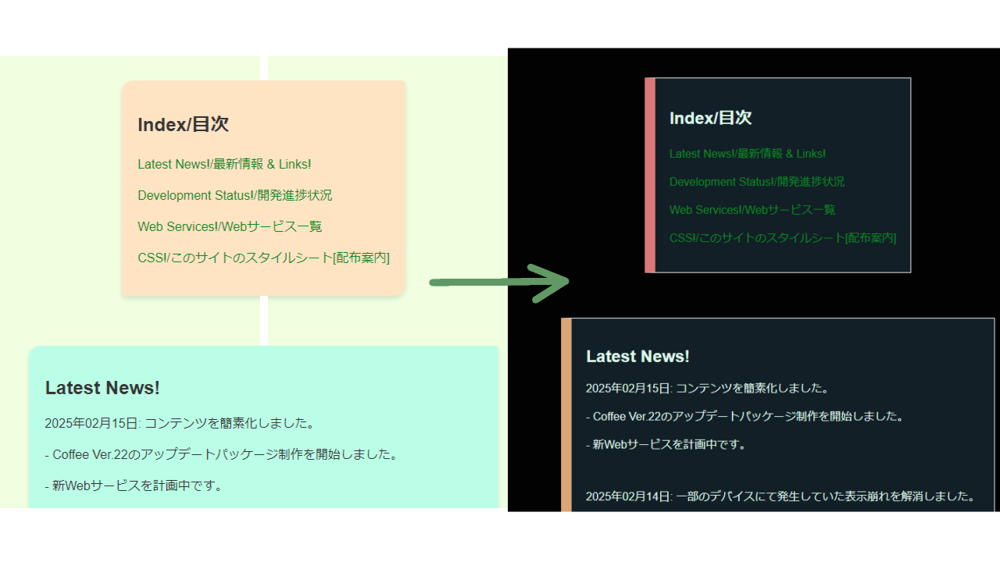

# FSLinear  
  
FSLinear -フリーでスマートな線形スタイルのCaffeineCSS互換スタイルシート  
FSLinearは商用非商用問わずどなたでも簡単に利用できる**無料のスタイルシート**です。  
サイトを**クールな雰囲気**にデコレーションします。  
また<a href="https://github.com/yokonoha/Caffeine_CSS">CaffeineCSS</a>の互換スタイルシートですので、ダークモード用テーマとしてもご活用いただけます。  
IT系のサイトや個人サイト製作のお供に、是非。  
************************************
(このリポジトリは予告なしに削除される場合がありますので、使用時は直リンクを避け、ご自身のサーバーへアップロードすることをお勧めします。ご自身のサーバーにアップロードできない場合は非推奨ではありますがscriptタグを以下のように設定してください。)  
```sample.html
<!--ミラーサイトによるFSLinearホスティング-->
<!--予告なしに終了する場合がございます。-->
<script src="https://yokonoha.pages.dev/fslinear.css"></script>
```
ライセンスはMITライセンスまたは横茶横葉Aライセンスのいずれかからお選びいただけます。(注:このライセンスは「オープンソースライセンス」であり、価格体系に関するライセンスではございません。利用料は無料です。)  

実装方法から活用例、チートシート等を掲載いたしました。ご自由にご活用ください!  
*******************************************
## プロモーション&実装例    
  
CaffeineCSSと同様にスマホ,PCなどの多様な画面サイズに対応しています。(自動伸縮)  
左側の枠線のみに着色することでシンプルかつ統一感のあるデザインを実現しました。  
角のある枠デザインを採用。また、夜間でも読みやすい黒基調のスタイルに仕上がっています。  
  
CaffeineCSSと同じClassで構成されています。linkタグの文字列をcaffeine.cssからfslinear.cssに変更するだけで簡単にテーマ変更が可能です。  
またCaffeineCSSにはないコンポーネントとして"WhiteMark"と"space"が追加されました!  
また、FSLinearではcntクラス(CaffeineCSSのstem用div)はspace(空白)に設定されています。  
  
こちらは実装例です。  
リンクテキストは既定の青色から緑色に変更され、視認性が向上し、下線も隠してすっきりしたデザインになりました。  
文章量に応じて自動的にサイズ変更されますが、画面からはみ出ることはありません。(但し、大きなサイズの画像使用時を除きます。)  
***********************************
## 使い方  
このセクションでは実装方法を説明していますが、同じ内容はダウンロードページにあるBasicTemplate.htmlにも記載されています。このセクションを飛ばしてそちらをご利用いただいても問題ありません。なお、BasicTemplate.htmlにはライセンスはございませんのでご自由にご活用ください。  
**********
### はじめに (環境設定)  
Fslinearなどの外部CSSファイルを適用するには、cssファイル本体を編集中のhtmlファイルと同じディレクトリへコピーした後に、以下の一文をheadタグ内に記載する必要があります。  
```Init.html
<link href="fslinear.css" rel="stylesheet"/>
```
CaffeineCSSなど、他の外部CSSを適用する場合は順序やclass名の競合にお気を付けください。  

Tips  
試験的にCSSファイルを用意せずに試したい場合は非推奨ではありますが、こちらをご利用いただけます。  
```sample.html
<!--ミラーサイトによるFSLinearホスティング-->
<!--予告なしに終了する場合がございます。-->
<script src="https://yokonoha.pages.dev/fslinear.css"></script>
```
*************
### タイトル表示  
最初のタイトル表示は以下のように設定します  
```titlesample.html
<div class="A"><!--この部分の"A"をA~Zまで指定することで色を変えることができます。-->
    <div class="title">
        <!--画像パスを変更して下さい。-->
        <h1>(サイト名を入力)</h1> 
    </div>
</div>
```
### コンテンツ格納div要素のデコレーション  
コンテンツはclass指定付きのdiv要素を使用して格納します。  
classの値にはA~Zの大文字アルファベットを代入します(注1)。全てのアルファベットでカラーリングが異なります。  

<small>注1: Rev.1時点では大文字アルファベット24文字分が利用できます。今後アップデートされる場合は利用可能なclass値が新規追加される場合があります。</small>
```divsample.html
<div class="C"> <!--この部分の"C"をA~Zまで指定することで色を変えることができます。-->
    <h3>新着情報</h3>
    <p>サイト管理者からのお知らせがここに表示されます。</p><!--使用例です-->
    <p>現在、お知らせがありません。</p>
</div>
```
### space(空白)  
FSLinearにおいて、spaceはコンテンツ格納div間を離す役割を担っています。  
適用する際は以下のようにします。  
```space.html
<!--新式の記述方法(FSLinearのみ機能します)-->
<div class="space"></div>

<!--従来の記述方法(CaffeineCSS互換の記述方法)-->
    <div class="cnt"><p></p></div>
    <div class="cnt"><p></p></div>
    <div class="cnt"><p></p></div>
    <div class="cnt"><p></p></div>
```
これはコンテンツ配置を視覚的にわかりやすく示すために使用されます。  
<u>表示崩れを避けるため、新式では要素をdiv内に含めず、また旧式のdiv内p要素には何も入力しません。</u> 
*********************************************
### マーク化  
テキストを選択不能なミニサイズのマークに変換することができます。  
テキストは各p要素へ記載します。  
以下のようにmarks-container内に配列することで正しい形で横並びに配列されます。  
class値は以下6種から選べます。  
(b:青1/b2:青2/y:黄/o:オレンジ/r:赤/g:緑)  
CaffeineCSSとはカラーが変更されています。  
```marks.html
<div class="marks-container"><!--整頓専用のclass値-->
    <div class="marks-r-b2">
        <p>Marks</p>
    </div>
    <div class="marks-r-y">
        <p>decoration</p>
    </div>
    <div class="marks-r-b">
        <p>by</p>
    </div>
    <div class="marks-r-o">
        <p>utilizing</p>
    </div>
    <div class="marks-r-r">
        <p>FSLinear</p>
    </div>
    <div class="marks-r-g">
        <p>Style!</p>
    </div>
</div>
```

******************
### フッター部分  
フッターはデフォルトで黒く着色されます。  
この例にある権利表記文は、横茶横葉Aライセンスをご利用の場合、このままご利用いただければ全く問題ありません。**この通り記載することでライセンス上の権利表記要件を満たしたこととなります**。  
(MITライセンスを選択された方は、MITライセンスの一般的な表記方法に従ってください。)  
```footersample.html
<footer>
<p><small>このページでは<a href="https://github.com/yokonoha/FSLinear" id="interchangeablecssprofiles">FSLinear</a>を使用しています。</small></p>  
</footer>
```
idはテーマ変更時に使用したい方以外は指定しなくてもOKです。  
横茶横葉Aライセンスを選択された方で、デザインの関係上この権利表記文が障害となる場合、省略を正式に可とします。  
製作者は記載漏れがあった場合、故意である場合を除き、指摘は致しませんのでご安心ください。この権利表記文を必須とした理由はスタイルシート本体に何らかの不備が見つかった場合に利用者様へ迅速にお知らせできるようにするためです。  

## ライセンスについて  
このCSSは無料でご活用いただけますが、**オープンソースライセンスまたは独自ライセンスが付加されています**。  
これらのライセンスは保証、利用条件、利用許可 などを記載したものであり、価格体系を示すものではありません。  
FSLinearはMITライセンス(オープンソースライセンス)と横茶横葉Aライセンス(独自ライセンス)のマルチライセンス体系を採用しています。  
どちらにも長所と短所がございますので、利用者様の用途に合わせてお好きなものをどちらか一つお選び下さい。  

### 要点(抜粋)
- **MITライセンス** 
    - 世界的に使用されている、有名なオープンソースライセンス  
    - 様式に基づいた権利表記が必要  
    - 正式かつフォーマルな条文
- [**横茶横葉Aライセンス**](https://yokonoha.github.io/alicense)  
    - 主に横茶横葉が製作した成果物に付加される独自の互換ライセンス  
    - 条件は緩く、商用利用が可能  
    - 条文は口語(ラフな文調)での記述  
    - 権利表記は端的に記載しても問題なし
    - 見過ごせないほど良くない使い方でない限りは問題なし  
    - 条文の記載は一切不要  
    - 横茶横葉の利用規約に従う(但し、再配布は例外的に可能)  
- **共通事項**  
    - 製作者はいかなる責任も負いかねます  
    - 無償  
    - 改変可能  
    - 再配布可能  

製作者より: 色々複雑なライセンス体系となってしまい、申し訳ございません。長々と書いてしまいましたが、あまり難しく考えたくない方は横茶横葉Aライセンスを適用してご利用ください。footerの権利表記文のみで大体は条件を満たしたことになります!(できる限り記載していただきたいですが、やむを得ない場合は書かなくても指摘はしません!) 横茶横葉の独自ライセンスは初心者でもリスクなしで安心して利用できるようにするために設定されています!  

## チートシート  
このセクションと同じ内容はダウンロードページにあるBasicTemplate.htmlにも記載されています。このセクションを飛ばしてそちらをご利用いただいても問題ありません。なお、BasicTemplate.htmlにはライセンスはございませんのでご自由にご活用ください。  
**********
### HTML様式(CaffeineCSS適用済み)  
```
<!DOCTYPE html>
<html>
<head>
    <link href="fslinear.css" rel="stylesheet"/>
  <meta name="viewport" content="width=device-width,initial-scale=1">
  <title>ページタイトル</title>
  <meta charset="UTF-8">
</head>
<body>
  
</body>
</html>
```
Modified from [Blank HTML Template](https://github.com/yokonoha/blank_HTML_Template/blob/main/basic_style.html)  

### Bodyタグ部分(全て)
```body.html
    <header>
        <p>Header</p>
    </header>
<div class="space"></div>
  <div class="A">  
    <div class="title">  
      
    <h1>title</h1>   
     </div>  
     </div>  
     <div class="cnt"><p></p></div>
     <div class="cnt"><p></p></div>
     <div class="cnt"><p></p></div>
     <div class="cnt"><p></p></div>
     <div class="B"> 
<!--マーク化テンプレート/Marks template-->

<!--div B Start-->
<div class="marks-container"><!--横並び用(align vertically)-->
    <div class="marks-r-b2">
        <p>Marks</p>
    </div>
    <div class="marks-r-y">
        <p>decoration</p>
    </div>
    <div class="marks-r-b">
        <p>by</p>
    </div>
    <div class="marks-r-o">
        <p>utilizing</p>
    </div>
    <div class="marks-r-r">
        <p>this</p>
    </div>
    <div class="marks-r-g">
        <p>CSS!</p>
    </div>
</div>

<!--div B End-->
    </div> 
    
    <div class="cnt"><p></p></div>
    <div class="cnt"><p></p></div>
    <div class="cnt"><p></p></div>
    <div class="cnt"><p></p></div>
    
    <div class="C">  
<!-- ここに要素を挿入-->
 <p>Simple White Mark Div</p>
 <div class="marks-container"><div class="whitemark">WH</div></div><!--P要素は使用せずお使いください-->


    </div>  
    
    <div class="cnt"><p></p></div>
    <div class="cnt"><p></p></div>
    <div class="cnt"><p></p></div>
    <div class="cnt"><p></p></div>
    
    <div class="D">  
<!-- ここに要素を挿入-->

    </div>  
    
    <div class="cnt"><p></p></div>
    <div class="cnt"><p></p></div>
    <div class="cnt"><p></p></div>
    <div class="cnt"><p></p></div>
    
    <div class="E">  
<!-- ここに要素を挿入-->

    </div>  
    
    <div class="cnt"><p></p></div>
    <div class="cnt"><p></p></div>
    <div class="cnt"><p></p></div>
    <div class="cnt"><p></p></div>
    
    <div class="F">  
<!-- ここに要素を挿入-->

    </div>  
    
    <div class="cnt"><p></p></div>
    <div class="cnt"><p></p></div>
    <div class="cnt"><p></p></div>
    <div class="cnt"><p></p></div>
    
    <div class="G">  
<!-- ここに要素を挿入-->

    </div>  
    
    <div class="cnt"><p></p></div>
    <div class="cnt"><p></p></div>
    <div class="cnt"><p></p></div>
    <div class="cnt"><p></p></div>
    
    <div class="H">  
<!-- ここに要素を挿入-->

    </div>
    <div class="cnt"><p></p></div>
    <div class="cnt"><p></p></div>
    <div class="cnt"><p></p></div>
    <div class="cnt"><p></p></div>
    <div class="I">  
        <!-- ここに要素を挿入-->
        
     </div>
     <div class="cnt"><p></p></div>
     <div class="cnt"><p></p></div>
     <div class="cnt"><p></p></div>
     <div class="cnt"><p></p></div>
     <div class="J">  
                <!-- ここに要素を挿入-->
                
     </div>
    <div class="cnt"><p></p></div>
    <div class="cnt"><p></p></div>
    <div class="cnt"><p></p></div>
    <div class="cnt"><p></p></div>
    <div class="K">  
     <!-- ここに要素を挿入-->
                        
     </div>
     <div class="cnt"><p></p></div>
     <div class="cnt"><p></p></div>
     <div class="cnt"><p></p></div>
     <div class="cnt"><p></p></div>
     <div class="L">  
      <!-- ここに要素を挿入-->
                         
      </div>
      <div class="cnt"><p></p></div>
      <div class="cnt"><p></p></div>
      <div class="cnt"><p></p></div>
      <div class="cnt"><p></p></div>
      <div class="M">  
       <!-- ここに要素を挿入-->
                          
       </div>
    <div class="cnt"><p></p></div>
    <div class="cnt"><p></p></div>
    <div class="cnt"><p></p></div>
    <div class="cnt"><p></p></div>
    <div class="N">  
    <!-- ここに要素を挿入-->

    </div>
    <div class="cnt"><p></p></div>
    <div class="cnt"><p></p></div>
    <div class="cnt"><p></p></div>
    <div class="cnt"><p></p></div>
    <div class="O">  
    <!-- ここに要素を挿入-->

    </div>
    <div class="cnt"><p></p></div>
    <div class="cnt"><p></p></div>
    <div class="cnt"><p></p></div>
    <div class="cnt"><p></p></div>
    <div class="P">  
    <!-- ここに要素を挿入-->

    </div>
    <div class="cnt"><p></p></div>
    <div class="cnt"><p></p></div>
    <div class="cnt"><p></p></div>
    <div class="cnt"><p></p></div>
    <div class="Q">  
    <!-- ここに要素を挿入-->

    </div>
    <div class="cnt"><p></p></div>
    <div class="cnt"><p></p></div>
    <div class="cnt"><p></p></div>
    <div class="cnt"><p></p></div>
    <div class="R">  
    <!-- ここに要素を挿入-->

    </div>
    <div class="cnt"><p></p></div>
    <div class="cnt"><p></p></div>
    <div class="cnt"><p></p></div>
    <div class="cnt"><p></p></div>
    <div class="S">  
    <!-- ここに要素を挿入-->

    </div>
    <div class="cnt"><p></p></div>
    <div class="cnt"><p></p></div>
    <div class="cnt"><p></p></div>
    <div class="cnt"><p></p></div>
    <div class="T">  
    <!-- ここに要素を挿入-->

    </div>
    <div class="cnt"><p></p></div>
    <div class="cnt"><p></p></div>
    <div class="cnt"><p></p></div>
    <div class="cnt"><p></p></div>
    <div class="U">  
    <!-- ここに要素を挿入-->

    </div>
    <div class="cnt"><p></p></div>
    <div class="cnt"><p></p></div>
    <div class="cnt"><p></p></div>
    <div class="cnt"><p></p></div>
    <div class="V">  
    <!-- ここに要素を挿入-->

    </div>
    <div class="cnt"><p></p></div>
    <div class="cnt"><p></p></div>
    <div class="cnt"><p></p></div>
    <div class="cnt"><p></p></div>
    <div class="W">  
    <!-- ここに要素を挿入-->

    </div>
    <div class="cnt"><p></p></div>
    <div class="cnt"><p></p></div>
    <div class="cnt"><p></p></div>
    <div class="cnt"><p></p></div>
    <div class="X">  
    <!-- ここに要素を挿入-->

    </div>
    <div class="cnt"><p></p></div>
    <div class="cnt"><p></p></div>
    <div class="cnt"><p></p></div>
    <div class="cnt"><p></p></div>
    <div class="Y">  
    <!-- ここに要素を挿入-->

    </div>
    <div class="cnt"><p></p></div>
    <div class="cnt"><p></p></div>
    <div class="cnt"><p></p></div>
    <div class="cnt"><p></p></div>
    <div class="Z">  
    <!-- ここに要素を挿入-->

    </div>

    <footer>

      <p><small>このページでは<a href="https://github.com/yokonoha/FSLinear" id="interchangeablecssprofiles">FSLinear</a>を使用しています。</small></p>  
    </footer>
```
FSlinear & Documentations made by Y.Yokoha.  
©2025 横茶横葉 All Rights Reserved.  
©2025 横葉の工房 All Rights Reserved.  
